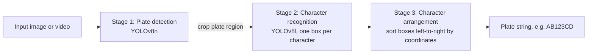

# Automatic Vehicle Number Plate Recognition (ANPR)

An end-to-end system that detects and reads vehicle license plates from images
and video. It is built for intelligent-transportation settings — access control,
tolling, traffic monitoring — where a plate has to be read reliably under varied
lighting, angles and fonts.

The pipeline uses **two YOLO models** instead of a classic OCR stage: one locates
the plate, a second reads each character as an object. A final step reorders the
characters by their position, so the plate string is correct even when characters
are detected out of order.


## How it works

Three stages, each independent so it can be inspected and debugged on its own:



1. **License-plate detection** — a YOLOv8n model localises the plate region in the
   frame and crops it out of the background.
2. **Character recognition (OCR)** — a second YOLO model (YOLOv8l) detects each
   alphanumeric character as an object. Treating OCR as detection is more robust to
   plate orientation and font than a traditional OCR engine, and stays real-time.
3. **Character arrangement** — a post-processing step sorts the recognised boxes by
   their bounding-box coordinates (top-to-bottom, then left-to-right) to rebuild the
   plate in the correct order.

## Results

Measured on the held-out test split:

| Model | Precision | Recall | mAP@50 | mAP@50-95 |
|-------|-----------|--------|--------|-----------|
| Plate detection (YOLOv8n) | 0.998 | 1.000 | 0.995 | 0.975 |
| Character OCR (YOLOv8l)   | 0.995 | 1.000 | 0.994 | 0.869 |

Training: 30 epochs for detection, 50 for OCR, batch size 16, 80/10/10 split.
Datasets in YOLO format: a Kaggle plate-detection set (~2,000 images) and a
Roboflow character set (~4,000 annotated images).

**Known limitation:** accuracy drops under strong motion blur and heavy occlusion.
The intended next step is targeted data augmentation, not yet implemented.

## Requirements

- Python 3.10+
- The packages in `requirements.txt` (`ultralytics`, which pulls in PyTorch, plus
  `opencv-python`, `gradio`, `matplotlib`)
- A CUDA GPU is optional; the models run on CPU, just slower.

## Setup

```bash
git clone https://github.com/LorenzoVenuti/license-plate-recognition.git
cd license-plate-recognition
pip install -r requirements.txt
```

The detection model `models/LP.pt` (~6 MB) ships with the repository. The OCR model
`Ocr.pt` (~250 MB) exceeds GitHub's per-file limit and is attached to the release:

```bash
# with the GitHub CLI, from the repository root
gh release download --pattern Ocr.pt --dir models
```

Or download `Ocr.pt` from the [Releases page](../../releases/latest) and place it in
`models/`. See [`models/README.md`](models/README.md) for details.

## Usage

### Graphical interface

```bash
python app.py
```

Launches a local Gradio app: upload an image, optionally type the expected plate,
and the app draws the detected plate and reports the recognised number.

### Notebook

`notebooks/anpr_pipeline.ipynb` walks through the full pipeline on a single image
and on a video, end to end. Put your own test media in `examples/` first — see
[`examples/README.md`](examples/README.md). No sample media is shipped: the models
were trained on real vehicle images, and readable plates are personal data.

## Repository layout

```
app.py                     Gradio GUI
notebooks/
  anpr_pipeline.ipynb      full pipeline, image + video
models/
  LP.pt                    plate detector (committed)
  Ocr.pt                   character OCR (from the release)
examples/                  your test media goes here
```

## Authors

Computer Vision course project by Shams Ul Amin, Martina Fontanesi and Lorenzo Venuti.


## License

Released under the [MIT License](LICENSE).
